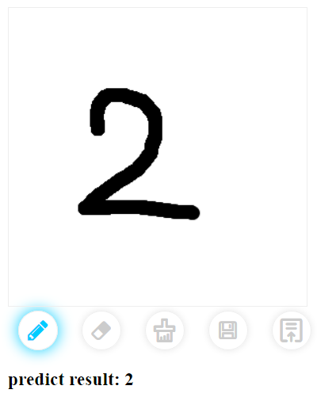

## MNIST_recognition
a small demo for MNIST using Flask to deploy Pytorch via RESTful API

### Dependency
* Python3
* Flask
* Flask-RESTful
* ONNX Runtime

### Screenshot


### Demo
```
python MNIST.py
python demo.py
```

## Reference
https://github.com/zhoushuozh/drawingborad
